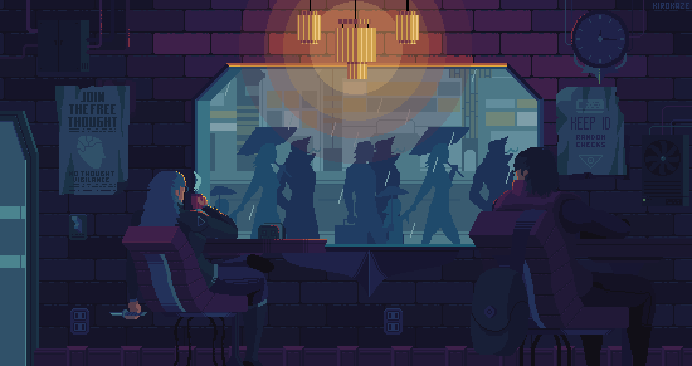

<p align="center">
  
</p>

<!-- Tamanho: width="850" -->
<p align="center">
   
</p>

## <p align="center"> Grab a cup of code! Excited to connect and chat about tech. 💬 </p>

<p align="center"> 
    <a href="https://www.linkedin.com/in/lucashenrique-santos/">
        
    </a>
    <a href="mailto:lucas.hneto@hotmail.com">
        
    </a>
    <a href="https://discord.com/users/379762938019446785">
        
    </a>
    
</p>

#  A Little Bit About Me and My Interests

```yaml

name: Lucas Henrique Santos Neto
located_in: Recife, Pernambuco
education:
  [
    "Passionate about learning and always curious",    
    "Bachelor's Degree in Computer Engineering at University of Pernambuco (UPE/Poli)"
  ]

fields_of_interests:
  [
    "Data Science",
    "Machine Learning",
    "Virtual Reality",
    "Game Development"
  ]

technical_background:
  [
    "Software Developer",
    "Intern - Data Analyst"
  ]
  
hobbies: ["Gaming", "Cinema", "Animation", "Geek"]

```

# 📊 Metrics

<p align="center">
  
  
  
  
</p>

<p align="center">
  
</p>
